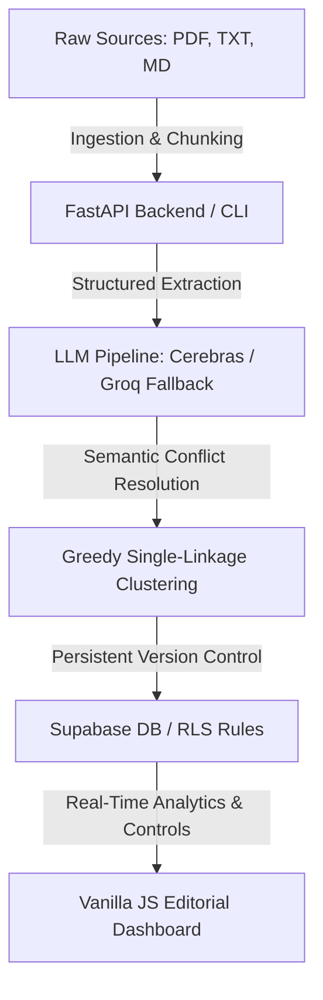

# Edu-Curator Content Generation Pipeline

> **Author / Principal Engineer:** Parth Sidhu  
> **Architecture:** FastAPI (ASGI) Backend + Vanilla JS SPA Frontend + Supabase DB with Row-Level Security (RLS) + LiteLLM Multi-Provider Fallback Routing

---

Edu-Curator is an enterprise-grade automated curation pipeline designed to ingest raw educational sources (PDFs, text files, markdown, web pages), extract factual components using structured schemas, resolve semantic conflicts, and generate high-fidelity, syllabus-aligned knowledge bases.

The system features a custom, premium dashboard styled around a high-contrast editorial design language with glassmorphism, responsive animations, and strict security posture.

---

## 🏗️ Architecture & Core Features



### 1. Robust Pipeline Engine (`src/edu_curator/`)
- **Layout-Aware Ingestion**: Layout-preserving PDF block extraction with EasyOCR fallbacks.
- **Pydantic Extraction Schemas**: Strict schema-conforming parsing of raw concepts and instructions.
- **Greedy Semantic Resolver**: Aggregates overlapping or conflicting extractions using high-dimensional vector embeddings, weighted confidence scores, and CQRS manual override merging.
- **Token Tracking & Logging**: In-database token logs tracking Cerebras and Groq billing footprint.

### 2. Resilient LLM Routing
- **Multi-Provider Fallbacks**: Automatically routes primary requests to **Cerebras**. If rate limits (HTTP 429) or timeouts occur, it falls back dynamically to **Groq** via LiteLLM.
- **Intelligent Retry Mechanism**: Implements exponential backoff (e.g., 65-second delay for rate limits) across 10 retries to maximize job success rates.

### 3. Highly Polished Editorial Dashboard (`dashboard/`)
- **Premium Design System**: Tailored HSL colors, elegant typography, fluid transitions, and no generic visual footprints.
- **Interactive Simulator Sandbox**: Allows real-time curation simulations before committing to production tables.
- **Row-Level Security (RLS)**: Database-enforced workspace isolation ensuring users can only read/write their authorized topics.
- **Strict Security Controls**: Implements CSP nonces, DOMPurify HTML sanitizers, SSRF path protection, and OCC versioning.

---

## 🛠️ CLI Operations & Commands

Use the local Windows development terminal inside `D:\Encap Internship` to interact with the pipeline via the command line interface:

```powershell
# Set Python path and validate configuration
set PYTHONPATH=src
python -m edu_curator.cli check-llm-config

# Run the complete content generation pipeline for a specific topic (e.g., SN 5)
python -m edu_curator.cli run-topic --sn 5

# Step-by-Step Individual Commands
python -m edu_curator.cli ingest           # Ingest raw source materials
python -m edu_curator.cli chunk            # Split ingested documents into sliding-window chunks
python -m edu_curator.cli map-topic        # Map chunks to target syllabus topics
python -m edu_curator.cli extract          # Extract facts using LLM schemas
python -m edu_curator.cli resolve          # Run semantic conflict resolution
```

---

## 🚀 Getting Started

### 1. Prerequisites
- **Python 3.10+**
- **Docker & Docker Compose** (optional, for containerized deployments)
- A **Supabase** project instance

### 2. Local Environment Configuration
Create a `.env` file in the root directory (refer to `.env.example`):
```env
SUPABASE_URL="https://your-project.supabase.co"
SUPABASE_KEY="your-supabase-service-role-key"
SUPABASE_ANON_KEY="your-supabase-anon-key"
CEREBRAS_API_KEY="your-cerebras-key"
GROQ_API_KEY="your-groq-key"
ALLOWED_EMAILS="parth@example.com,developer@example.com"
```

### 3. Run the Development Server
```powershell
python dashboard/serve.py
```
Access the dashboard locally at: **`http://localhost:8502`**

### 4. Running the Test Suite
Verify pipeline integrity using the automated test suite containing 43 unit and integration tests:
```powershell
python -m pytest tests/ -v
```

### 5. Running with Docker
```bash
docker compose build
docker compose up -d
```

---

## 📄 Documentation Index
- [Architecture Details](file:///D:/Encap%20Internship/architecture.md) — Exhaustive layout of modules, DB schema, and data flows.
- [Operations Runbook](file:///D:/Encap%20Internship/RUNBOOK.md) — Deployment, health checks, rollback, and diagnostics.
- [Requirements Spec (CRS)](file:///D:/Encap%20Internship/crs.md) — Comprehensive requirements and validation matrix.
- [Engineering Design (EPS)](file:///D:/Encap%20Internship/eps.md) — Pipeline structure and class specifications.
- [DB Schema Design (DSR)](file:///D:/Encap%20Internship/dsr.md) — DB schema layout and migration details.
