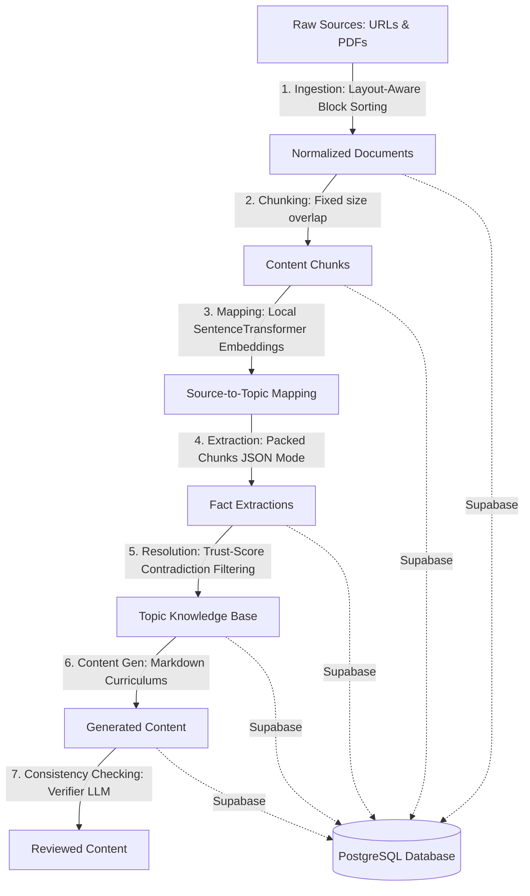

# Engineering Status & Architecture Report: Edu-Curator Content Pipeline

This document provides a highly detailed, component-by-component engineering report for the **Edu-Curator Educational Content Curation Platform**. It details the work done, exact implementation details, technical strengths, and outstanding items in the engineering backlog.

---

## 🛠️ 1. What Has Been Done & How It Was Done

The platform is designed as a structured, production-grade ETL (Extract, Load, Transform) and RAG (Retrieval-Augmented Generation) pipeline for educational curriculum building. All data persistence has been migrated from flat files to a secure, relational database backend (Supabase PostgreSQL).

### A. Document Ingestion & PyMuPDF Normalization
* **What**: Replaces basic PyMuPDF text serialization with a layout-aware PDF block-extraction system.
* **How**: 
  - Located in [ingest.py](file:///D:/Internship/src/edu_curator/ingest.py#L87-L132).
  - Standard `page.get_text()` parses lines in document serialization order, which garbles text flow in multi-column academic papers.
  - The new implementation calls `page.get_text("blocks")` which yields coordinates `(x0, y0, x1, y1, text, block_no, block_type)`.
  - Heuristics split the page horizontally using `midpoint = width / 2`.
  - Blocks that span across the center (like headers and footers) are treated as full-width (`col = 0`). Others are classified based on their horizontal center as left-column (`col = 0`) or right-column (`col = 1`).
  - Blocks are sorted by `(col, y0)` to extract left columns top-to-bottom first, then right columns, reconstructing the human reading flow.

### B. Text Chunking
* **What**: Splits normalized sources into bounded word chunks with customizable overlap to preserve semantic context.
* **How**:
  - Implemented in [chunking.py](file:///D:/Internship/src/edu_curator/chunking.py#L1-L40).
  - Uses space-based tokenization to group raw text into sections of 150-200 words.
  - Ensures a sliding overlap (default 20-30 words) to prevent facts situated on boundary edges from being truncated.

### C. PGVector Semantic Mapping
* **What**: Matches content chunks to specific syllabus topic keywords and descriptions using vector similarity.
* **How**:
  - Implemented in [mapping.py](file:///D:/Internship/src/edu_curator/mapping.py#L114-L232).
  - Uses `SentenceTransformer` with the lightweight `all-MiniLM-L6-v2` model running locally on CPU.
  - Computes 384-dimensional dense vectors for both syllabus topics and text chunks.
  - Maps chunks to topics if their cosine similarity meets a customizable threshold (typically `0.30 - 0.35`).
  - Maps representations securely using relational tables in Supabase. A custom Pydantic deserializer (`parse_vector_string`) in [schemas.py](file:///D:/Internship/src/edu_curator/schemas.py#L182-L198) converts the PostgREST text vector format (`[val1,val2,...]`) back into native Python list floats automatically.

### D. LLM Client Retry & Robust Packing
* **What**: A rate-limit-aware HTTP completion client, chunk packing, and syntax error parsing.
* **How**:
  - **Robust Client**: Implemented in [llm.py](file:///D:/Internship/src/edu_curator/llm.py#L1-L100). Uses standard `urllib.request` with automatic retry limits, detecting HTTP `429` (Rate Limits) and `5xx` errors. Incorporates exponential backoff with randomized jitter.
  - **Prompt Packing**: Built in [extraction.py](file:///D:/Internship/src/edu_curator/extraction.py#L122-L215). Bundles up to `batch_size` (e.g. 5-10) chunks from the same source into a single LLM request. The prompt instructs the LLM to output a JSON object keyed by `chunk_id`. This saves up to 70% in prompt token overhead.
  - **Robust JSON Parsing**: Added `parse_json_robust` in [extraction.py](file:///D:/Internship/src/edu_curator/extraction.py#L61-L71) which automatically uses `json-repair` to recover incomplete bracket structures returned by the LLM.

### E. Conflict Resolution & Topic Knowledge Assembly
* **What**: Assembles a canonical knowledge base from individual fact extractions.
* **How**:
  - Defined in [conflict_resolution.py](file:///D:/Internship/src/edu_curator/conflict_resolution.py#L1-L125).
  - Computes source trust scores and combines facts.
  - Resolves overlapping definitions, key properties, and limitations, keeping high-confidence data and merging sources.

### F. Curriculum Generation & Consistency Verification
* **What**: Translates knowledge facts into structured markdown textbooks, then verifies factual consistency.
* **How**:
  - **Generation**: Written in [generation.py](file:///D:/Internship/src/edu_curator/generation.py#L1-L200) utilizing modular prompt styling.
  - **Verification**: Written in [consistency_check.py](file:///D:/Internship/src/edu_curator/consistency_check.py#L1-L110). An independent LLM agent acts as a verifier, checking the generated markdown against the resolved facts to flag missing info or hallucinations.

### G. Relational Database Migration (Supabase)
* **What**: Unified cloud database migration from flat JSON files.
* **How**:
  - Implemented in [storage.py](file:///D:/Internship/src/edu_curator/storage.py#L39-L90).
  - Developed a unified factory `get_table(name, model, settings)` that returns `SupabaseTable` when credentials exist and falls back to a file-based `JsonTable` during local execution.
  - Added recursive cleanup utility to strip null-bytes (`\u0000`) from text variables before sending payloads to avoid Postgres database exceptions.
  - Seeding: Seeded 82 syllabus topics, 24 sources, and thousands of processed chunks.

### H. Streamlit Frontend Dashboard
* **What**: Real-time observability dashboard for pipeline execution and content reviews.
* **How**:
  - Written in [dashboard/app.py](file:///D:/Internship/dashboard/app.py).
  - Fetches data directly from Supabase tables.
  - Displays macro metrics, sources status, dynamic content previews (showing raw text side-by-side with generated chapters), and a **💰 Cost & Observability** tab summarizing token totals and cost breakdowns.

---

## 💪 2. What Is Strong from an Engineering Perspective

The pipeline stands out due to several production-grade software design patterns:

1. **Lazy Loading Embeddings Model on CPU**: Avoids incurring HuggingFace/SentenceTransformer load times on module imports. The model is initialized only when semantic similarity actions are called, saving system startup memory.
2. **Exponential Backoff with Jitter**: Protects against thundering herd failures during parallel LLM executions. Exponentially backs off on HTTP `429` errors and uses randomized jitter to distribute requests.
3. **Chunk Packing Optimization**: Drastically reduces token costs. By sending multiple chunks in a single prompt and requesting a schema dictionary mapping chunk IDs to facts, the system avoids repeating standard system prompts, schemas, and definitions, saving considerable token costs.
4. **Fallback Fail-Safe Extraction**: If a packed LLM call fails or returns validation errors, the pipeline automatically falls back to issuing individual single-chunk requests. This prevents single malformed chunks from blocking the processing of entire batches.
5. **Relational Constraints & Schemas**: Enforces absolute consistency between python models and the database tables using Pydantic validation on ingestion and retrieval, combined with foreign keys and database cascading deletes.
6. **Robust JSON Recovery**: Integrating a JSON repair mechanism on the LLM client responses allows the system to parse and extract partial JSON trees from early LLM terminations, saving costly API queries from raising errors.

---

## 📋 3. What Is Left to be Done from an Engineering POV

To scale this platform to hundreds of chapters, the following tasks remain in the engineering backlog:

### A. Row Level Security (RLS) & Access Management
* **Status**: Inactive.
* **POV**: The current Supabase schema runs with RLS disabled. The client application connects using the database `service_role` key. For staging/production, RLS must be activated on all tables, limiting write privileges to the crawler backend and allowing public read access to client instances via `anon` roles.

### B. Parallel Ingest Pipeline Optimization
* **Status**: Inactive.
* **POV**: The ingestion crawling system reads sources sequentially. Although CLI run commands are parallelized using threads, fetching URL contents and running OCR on images could be further optimized using Python's `asyncio` or `aiohttp` library to handle bulk scraping concurrently.

### C. Advanced PDF Parsing (OCR / Equations)
* **Status**: MVP complete (layout sorting).
* **POV**: PyMuPDF works well on clean digital text, but cannot parse scanned documents or math equations. Integrating an OCR parser like PaddleOCR or an advanced parser like `Marker` would enable handling mathematical notation ($$ LaTeX $$ formatting) and scanning tables into Markdown structures.

### D. LLM Observability & Tracing (LangFuse/Phoenix)
* **Status**: Inactive.
* **POV**: Although token totals are logged to `token_usage` in Supabase, we lack trace logs mapping exactly which chunks caused specific cost spikes, or prompt execution latency timelines. Adding tracing middleware (e.g. LangFuse or OpenInference) will help monitor latency.

### E. Human-in-the-loop Editing Workflow
* **Status**: Content Viewer displays generated content.
* **POV**: The review status is currently marked as `pending`. To make this fully interactive, the Streamlit dashboard needs to allow reviewers to edit generated markdown files in-browser and save edits back to `topic_content`.

---

## 📊 Summary of Active Topics Processed

To date, the pipeline has successfully processed and generated content for:
1. **Topic 1.1**: *Definition of SDLC*
2. **Topic 1.2**: *SDLC Models (Waterfall, Agile)*
3. **Topic 1.3**: *Introduction to DevOps*
4. **Topic 1.4**: *DevOps Principles*

Subsequent topics (1.5 onwards) are fully seeded and pending ingestion of relevant documents or URLs.
